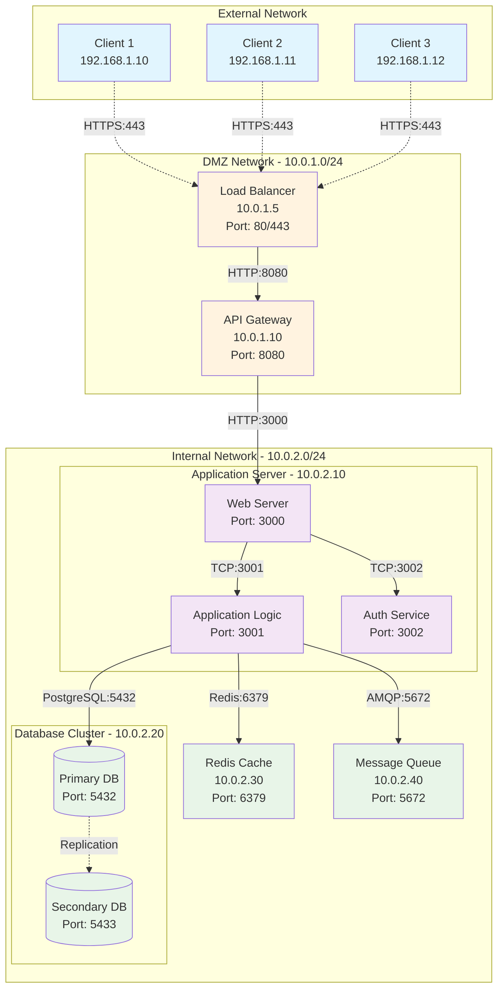
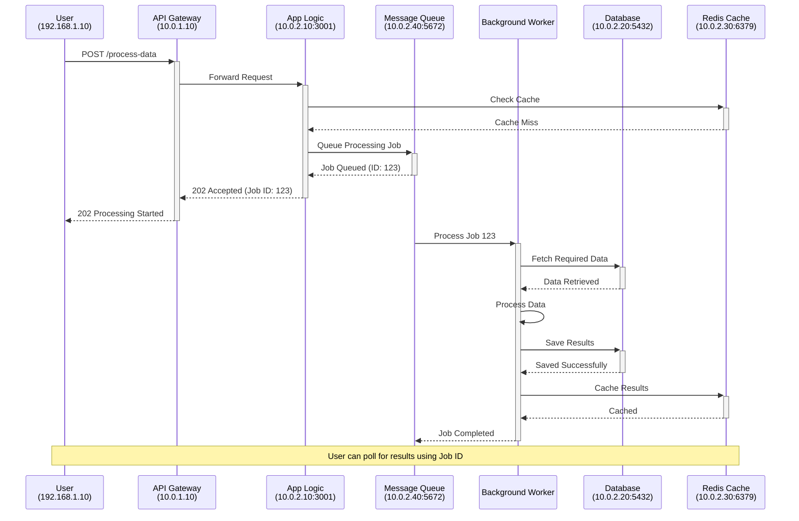

<h1 align="center">Installation Guideline - Project Name</h1>
<hr>

> [!CAUTION]
> Make this document private by default. Only make it public after publishing the project.
>
> Request access with the GitHub admin in our group.

> [!NOTE]
> **Purpose of User Guide vs Installation Guide:**
> - **Installation Guide**: Focuses on setup, configuration, and getting the system running
> - **User Guide**: Focuses on how to **use** the system once it's installed and running
> - **System Architecture & MSC**: Only include simplified versions if they help users understand workflows

## Table of Contents
to allow other people to quickly navigate especially long or detailed READMEs.
- [Table of Contents](#table-of-contents)
- [Project description](#project-description)
- [Access Method (if any)](#access-method-if-any)
- [Action Items](#action-items)
- [System Architecture](#system-architecture)
- [Minimum Requirements](#minimum-requirements)
- [Message Sequence Chart (MSC)](#message-sequence-chart-msc)
  - [User Authentication Flow](#user-authentication-flow)
  - [Data Processing Flow](#data-processing-flow)
  - [Repository Structure](#repository-structure)
  - [Configuration](#configuration)
  - [Installation Steps](#installation-steps)
- [Post-Installation Verification](#post-installation-verification)
- [Troubleshooting](#troubleshooting)
  - [Common Issues and Solutions](#common-issues-and-solutions)
- [Additional Resources](#additional-resources)


## Project description
**Project Name:** [Replace with actual project name]

**Description:** A comprehensive solution for [specific use case]. This project provides [key functionality] and enables users to [main benefits]. 

**Key Features:**
- Feature 1: [Brief description]
- Feature 2: [Brief description] 
- Feature 3: [Brief description]

**Target Users:** [Developers/Researchers/System Administrators/etc.]

## Access Method (if any)
```
Host: <IP address>
User: <username>
```

```
ssh user@<IP address>
```

## Action Items

| Step                      | Command/Action                                      | Description                                      |
|---------------------------|-----------------------------------------------------|--------------------------------------------------|
| Clone the repository      | `git clone https://github.com/your-username/your-repo.git` | Clone the project repository to your local machine |
| Install dependencies      | `npm install`                                       | Install all necessary dependencies               |
| Set up environment variables | Create a `.env` file and refer to `.env.example` | Configure environment variables                  |
| Run the application       | `npm start`                                         | Start the application                            |
| Open in browser           | Navigate to `http://localhost:3000`                 | Open the application in your web browser         |

## System Architecture

**Important Components to Include in System Architecture:**
1. **IP Addresses** - Specify IP address for each module/component
2. **Connection Types** - Clear indication of connection types (WiFi, RJ-45, etc. ) & protocols (HTTP, TCP, UDP, WebSocket, etc.)
3. **Sub-module Structure** - Show internal components and their relationships
4. **Data Flow Direction** - Indicate request/response patterns
5. **Port Numbers** - Specify communication ports
6. **Network Boundaries** - Show different network segments (DMZ, internal, external)



## Minimum Requirements

| Component       | Requirement                  |
|-----------------|------------------------------|
| Operating System| Ubuntu 22.04 or higher       |
| CPU             | 2 GHz dual-core processor    |
| Memory          | 4 GB RAM                     |
| GCC Version     | 7.5 or higher                |
| Python Version  | 3.6 or higher                |
| Kubernetes      | 1.18 or higher               |


## Message Sequence Chart (MSC)

> [!NOTE]
> **MSC Should Include:**
> 1. **Actors/Components** - All participating systems and users
> 2. **Message Flow** - Sequential communication between components
> 3. **Timing** - Order of operations and dependencies
> 4. **Error Handling** - Alternative flows and error scenarios
> 5. **Data Validation** - Authentication and authorization steps

### User Authentication Flow

```mermaid
sequenceDiagram
    participant U as User<br/>(192.168.1.10)
    participant LB as Load Balancer<br/>(10.0.1.5)
    participant API as API Gateway<br/>(10.0.1.10)
    participant Web as Web Server<br/>(10.0.2.10:3000)
    participant Auth as Auth Service<br/>(10.0.2.10:3002)
    participant DB as Database<br/>(10.0.2.20:5432)
    participant Cache as Redis Cache<br/>(10.0.2.30:6379)

    U->>+LB: HTTPS Request (Login)
    LB->>+API: Forward Request
    API->>+Web: HTTP POST /auth/login
    Web->>+Auth: Validate Credentials
    Auth->>+DB: Query User Data
    DB-->>-Auth: User Information
    
    alt Valid Credentials
        Auth->>+Cache: Store Session Token
        Cache-->>-Auth: Confirmation
        Auth-->>-Web: Authentication Success + Token
        Web-->>-API: 200 OK + JWT Token
        API-->>-LB: Response with Token
        LB-->>-U: 200 OK + Set-Cookie
    else Invalid Credentials
        Auth-->>-Web: Authentication Failed
        Web-->>-API: 401 Unauthorized
        API-->>-LB: 401 Unauthorized
        LB-->>-U: 401 Unauthorized
    end
```

### Data Processing Flow




### Repository Structure

```
project-name/
├── src/                    # Source code
│   ├── main.py            # Main application entry point
│   └── modules/           # Application modules
├── config/                # Configuration files
│   ├── .env.example       # Environment variables template
│   └── settings.json      # Application settings
├── docs/                  # Documentation
├── tests/                 # Test files
├── requirements.txt       # Python dependencies
├── README.md             # Project overview
└── LICENSE               # License information
```

### Configuration

**Environment Variables:**
Create a `.env` file in the root directory with the following variables:

```bash
# Database Configuration
DB_HOST=localhost
DB_PORT=5432
DB_NAME=your_database_name
DB_USER=your_username
DB_PASSWORD=your_password

# Application Settings
APP_PORT=3000
APP_DEBUG=false
```

**Configuration Files:**
- `config/settings.json`: Contains application-specific settings
- Refer to `config/.env.example` for all available environment variables

### Installation Steps
Installation is the next section in an effective README. Tell other users how to install your project locally. Optionally, include a gif to make the process even more clear for other people.

1. **Clone the repository:**

    ```sh
    git clone https://github.com/your-username/your-repo.git
    cd your-repo
    ```

2. **Install dependencies:**
    ```sh
    pip install -r requirements.txt 
    ```

3. **Set up environment variables:**

    Create a `.env` file in the root directory and add the necessary environment variables. Refer to `.env.example` for guidance.

4. **Run the application:**

    ```sh
    python3 app.py
    ```

##  Post-Installation Verification

Follow these steps to verify your installation was successful:

1. **Check Application Status:**
   
   ```bash
   # Check if the application is running
   ps aux | grep app.py
   ```
   
   **Expected Result:** You should see the process running with PID and resource usage information.

2. **Test Basic Functionality:**
   
   ```bash
   # Test API endpoint (if applicable)
   curl http://localhost:3000/health
   ```
   
   **Expected Result:** Response should return `{"status": "OK", "timestamp": "..."}` or similar.

3. **Verify Database Connection:**
   
   ```bash
   # Run database connectivity test
   python3 -c "from src.main import test_db_connection; test_db_connection()"
   ```
   
   **Expected Result:** Output should confirm successful database connection.

## Troubleshooting

### Common Issues and Solutions

1. **Issue: Port already in use**
   
   **Error Message:** `Address already in use: 3000`
   
   **Solution:** 
   ```bash
   # Find process using the port
   sudo lsof -i :3000
   # Kill the process (replace PID with actual process ID)
   kill -9 <PID>
   ```

2. **Issue: Python dependencies not found**
   
   **Error Message:** `ModuleNotFoundError: No module named 'module_name'`
   
   **Solution:**
   ```bash
   # Reinstall dependencies
   pip install -r requirements.txt
   # Or install specific package
   pip install module_name
   ```

3. **Issue: Permission denied errors**
   
   **Error Message:** `Permission denied: '/path/to/file'`
   
   **Solution:**
   ```bash
   # Fix file permissions
   chmod 755 /path/to/file
   # Or run with appropriate user permissions
   sudo python3 app.py
   ```

## Additional Resources

**Documentation:**
- [Official Project Documentation](https://your-project-docs.com)
- [API Reference Guide](https://your-project-api.com)
- [Configuration Reference](https://your-project-config.com)

**Community Support:**
- [GitHub Issues](https://github.com/your-username/your-repo/issues)
- [Stack Overflow Tag](https://stackoverflow.com/questions/tagged/your-project)
- [Discord Community](https://discord.gg/your-project)

**Contact:**
- **Maintainer:** Your Name (your.email@example.com)
- **Support Team:** support@your-project.com
- **Emergency Contact:** +1-xxx-xxx-xxxx (for critical issues only)

---

> [!NOTE]
> This installation guide is regularly updated. For the latest version, check the [GitHub repository](https://github.com/your-username/your-repo).