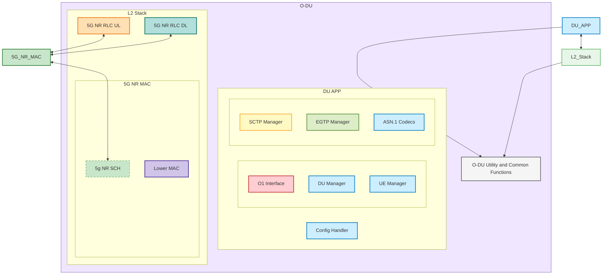
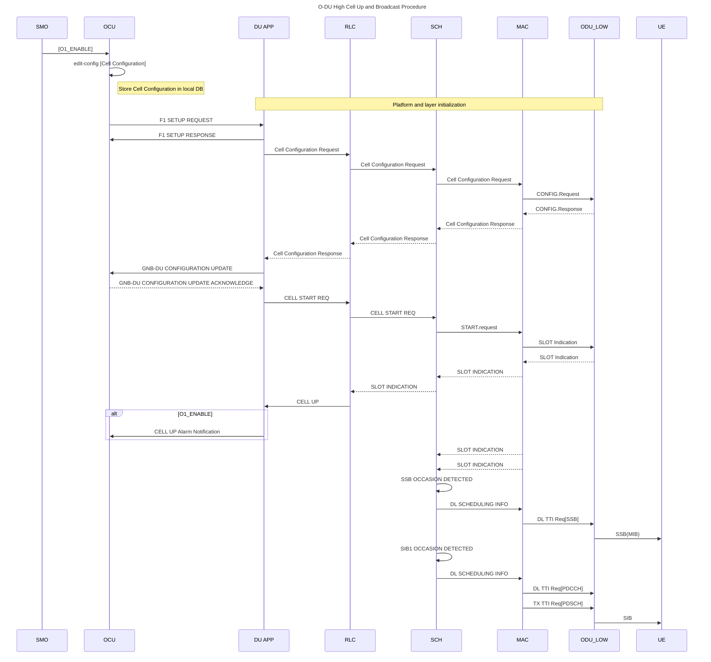

<h1 align="center">Installation Guideline - Project Name</h1>
<hr>

## Project description

**Project Name:** [Replace with actual project name]

**Description:** A comprehensive solution for [specific use case]. This project provides [key functionality] and enables users to [main benefits].

**Key Features:**

- Feature 1: [Brief description]
- Feature 2: [Brief description]
- Feature 3: [Brief description]

**Target Users:** [Developers/Researchers/System Administrators/etc.]

> [!CAUTION]
> Make this document private by default. Only make it public after publishing the project.
>
> Request access with the GitHub admin in our group.

> [!NOTE]
> **Purpose of Installation Guide:**
> This guide focuses on setup, configuration, and getting the system running on your local environment or target deployment system.

## Table of Contents

to allow other people to quickly navigate especially long or detailed READMEs.

- [Project description](#project-description)
- [Table of Contents](#table-of-contents)
- [Remote Access Methods](#remote-access-methods)
  - [SSH](#ssh)
  - [Anydesk](#anydesk)
- [Action Items](#action-items)
- [System Architecture](#system-architecture)
- [Repository Structure](#repository-structure)
- [Minimum Specification Requirements](#minimum-specification-requirements)
- [Table of Paramaters](#table-of-paramaters)
  - [Inputs Parameters](#inputs-parameters)
- [Message Sequence Chart (MSC)](#message-sequence-chart-msc)
  - [User Authentication Flow (O-RAN O1 Interface)](#user-authentication-flow-o-ran-o1-interface)
  - [Cell Configuration Flow (O-RAN F1 Interface)](#cell-configuration-flow-o-ran-f1-interface)
  - [Configuration](#configuration)
  - [Installation Steps](#installation-steps)
- [Post-Installation Verification](#post-installation-verification)
- [Troubleshooting](#troubleshooting)
  - [Common Issues and Solutions](#common-issues-and-solutions)
- [Additional Resources](#additional-resources)

## Remote Access Methods

### SSH

```shell
ssh user@<IP address>
```

### Anydesk

```markdown
ID: # Anydesk ID / Public IP / private IP with on VPN access
Pass: <password>
```

## Action Items

Write your installation/integration plan & status in here:

| Step                         | Command/Action                                               | Description                                        | Status |
| ---------------------------- | ------------------------------------------------------------ | -------------------------------------------------- | ------ |
| Clone the repository         | `git clone https://github.com/your-username/your-repo.git` | Clone the project repository to your local machine | ✅     |
| Install dependencies         | `npm install`                                              | Install all necessary dependencies                 | ✅     |
| Set up environment variables | Create a `.env` file and refer to `.env.example`         | Configure environment variables                    | ⌛️   |
| Run the application          | `npm start`                                                | Start the application                              | ❌     |
| Open in browser              | Navigate to `http://localhost:3000`                        | Open the application in your web browser           |        |

## System Architecture

**Important Components to Include in System Architecture (O-RAN O-DU Architecture Pattern):**

1. **O-RAN Interfaces** - F1, E2, O1, FAPI interfaces with specific protocols
2. **Functional Blocks** - L2/L3 protocol stack components (RLC, MAC, PDCP, RRC)
3. **Thread Architecture** - Multiple processing threads for different functional blocks
4. **Message Exchanges** - SCTP, EGTP, ASN.1 codecs for inter-module communication
5. **Management Interfaces** - O1 for configuration, alarms, and performance management
6. **IP Addressing** - Clear network topology following O-RAN deployment patterns

### O-DU System Architecture



## Repository Structure

> [!NOTE]
>
> 1. Add `.gitignore` file with C/C++ and O-RAN specific patterns.
> 2. Add Apache 2.0 LICENSE (standard for O-RAN projects).
> 3. Create O-RAN compliant source structure following O-DU High architecture.
> 4. Structure code following the [System Architecture](#system-architecture) with thread-based organization.

```
o-ran-o-du-l2/
├── src/                           # Main source code directory
│   ├── du_app/                    # DU Application Layer
│   │   ├── du_mgr.c              # DU Manager implementation
│   │   ├── du_ue_mgr.c           # UE Manager implementation
│   │   ├── du_cfg.c              # Configuration Handler
│   │   ├── du_f1ap_msg_hdl.c     # F1AP message handling
│   │   ├── du_e2ap_msg_hdl.c     # E2AP message handling
│   │   └── du_sctp.c             # SCTP interface handling
│   ├── 5gnrmac/                   # 5G NR MAC Layer
│   │   ├── lwr_mac_fsm.c         # Lower MAC FSM
│   │   ├── lwr_mac_handle_phy.c  # PHY interface handling
│   │   ├── mac_slot_ind.c        # Slot indication processing
│   │   ├── mac_upr_inf_api.c     # Upper interface APIs
│   │   └── mac_ue_mgr.c          # MAC UE management
│   ├── 5gnrrlc/                   # 5G NR RLC Layer
│   │   ├── kw_ul_ex_ms.c         # RLC UL main functions
│   │   ├── kw_dl_ex_ms.c         # RLC DL main functions
│   │   ├── kw_amm_ul.c           # AM mode UL processing
│   │   ├── kw_amm_dl.c           # AM mode DL processing
│   │   └── kw_uim.c              # Upper interface management
│   ├── 5gnrsch/                   # 5G NR Scheduler
│   │   ├── sch.c                 # Main scheduler functions
│   │   ├── sch_slot_ind.c        # Slot indication handling
│   │   ├── sch_ue_mgr.c          # UE management in scheduler
│   │   ├── sch_common.c          # Common scheduler functions
│   │   └── sch_utils.c           # Scheduler utilities
│   ├── cm/                        # Common modules
│   │   ├── common_def.c          # Common definitions
│   │   ├── lrg.c                 # Layer management
│   │   ├── du_app_rlc_inf.c      # DU-RLC interface
│   │   └── du_app_mac_inf.c      # DU-MAC interface
│   ├── codec_utils/               # ASN.1 Codecs
│   │   ├── F1AP/                 # F1AP ASN.1 codecs
│   │   ├── E2AP/                 # E2AP ASN.1 codecs
│   │   ├── RRC/                  # RRC ASN.1 codecs
│   │   └── common/               # Common codec utilities
│   ├── o1/                        # O1 Interface Module
│   │   ├── o1_client/            # O1 client implementation
│   │   ├── ves/                  # VES agent
│   │   ├── alarm/                # Alarm management
│   │   └── config/               # Configuration management
│   └── mt/                        # Multi-threading utilities
│       ├── mt_ss.c               # System services
│       └── mt_id.c               # Thread identification
├── build/                         # Build system
│   ├── scripts/                  # Build scripts
│   │   ├── build_odu.sh         # Main build script
│   │   └── cleanup.sh           # Cleanup script
│   ├── odu/                      # ODU build artifacts
│   └── makefile                  # Main makefile
├── config/                        # Configuration files
│   ├── startup_config.xml        # Initial configuration
│   ├── fapi_config.json         # FAPI configuration
│   └── odu_config.xml           # ODU configuration
├── docs/                          # Documentation
│   ├── overview.md               # Architecture overview
│   ├── user-guide.md            # User guide
│   ├── developer-guide.md       # Developer guide
│   └── api-docs/                # API documentation
├── tests/                         # Test framework
│   ├── scripts/                  # Test scripts
│   ├── stub/                     # Stub implementations
│   │   ├── cu_stub/             # CU stub
│   │   ├── ric_stub/            # RIC stub
│   │   └── phy_stub/            # PHY stub
│   └── integration/              # Integration tests
├── tools/                         # Development tools
│   ├── fapi_decoder/            # FAPI message decoder
│   ├── memory_analyzer/         # Memory leak detection
│   └── log_analyzer/            # Log analysis tools
├── bin/                           # Binary executables
│   ├── odu                      # Main ODU executable
│   ├── cu_stub                  # CU stub executable
│   └── ric_stub                 # RIC stub executable
├── .gitignore                     # Git ignore patterns
├── LICENSE                        # Apache 2.0 License
├── README.md                      # Project overview
├── CONTRIBUTING.md                # Contribution guidelines
└── CHANGELOG.md                   # Change log
```

## Minimum Specification Requirements

| Component        | Requirement               |
| ---------------- | ------------------------- |
| Operating System | Ubuntu 22.04 or higher    |
| CPU              | 2 GHz dual-core processor |
| Memory           | 4 GB RAM                  |
| GCC Version      | 7.5 or higher             |
| Python Version   | 3.6 or higher             |
| Kubernetes       | 1.18 or higher            |

## Table of Paramaters

> [!NOTE]
> **Parameter Comparison Guidelines:**
>
> 1. **Standards Compliance** - All vendor implementations must maintain backward compatibility with 3GPP standards
> 2. **Performance Enhancement** - Vendor-specific features often provide performance improvements beyond standard requirements
> 3. **Interoperability** - Ensure vendor-specific parameters don't compromise network interoperability
> 4. **Documentation** - Always refer to the latest version of specifications as standards evolve
> 5. **Testing** - Validate vendor-specific implementations against 3GPP test cases

### Inputs Parameters

| Parameter Name                  | Description                                    | 3GPP Reference                                                                      | 3GPP Standard     | Ericsson                                                                                   | Nokia                                                                              | Huawei                                                                           | Samsung                                                         |
| ------------------------------- | ---------------------------------------------- | ----------------------------------------------------------------------------------- | ----------------- | ------------------------------------------------------------------------------------------ | ---------------------------------------------------------------------------------- | -------------------------------------------------------------------------------- | --------------------------------------------------------------- |
| **Cell ID**               | Unique identifier for each cell in the network | [TS 36.211 Section 6.11](https://www.3gpp.org/ftp/Specs/archive/36_series/36.211/)     | nrCellIdentity    | [Cell Identity (CI)](https://www.ericsson.com/en/ran)                                         | Cell_ID                                                                            | Cell_Identifier                                                                  | CellId                                                          |
| **Tracking Area Code**    | Area identifier for location management        | [TS 23.003 Section 19.4.2.3](https://www.3gpp.org/ftp/Specs/archive/23_series/23.003/) | trackingAreaCode  | TAC_Enhanced                                                                               | [TAC_Extended](https://www.nokia.com/networks/mobile-networks/airscale-radio-access/) | TAC_Advanced                                                                     | TAC_Optimized                                                   |
| **PLMN ID**               | Public Land Mobile Network identifier          | [TS 23.003 Section 2.2](https://www.3gpp.org/ftp/Specs/archive/23_series/23.003/)      | plmnIdentity      | PLMN_ID                                                                                    | PLMN_Identifier                                                                    | [PLMN_Enhanced](https://carrier.huawei.com/en/products/wireless-network/small-cell) | PLMN_Code                                                       |
| **Bandwidth**             | Radio channel bandwidth allocation             | [TS 36.104 Section 5.6](https://www.3gpp.org/ftp/Specs/archive/36_series/36.104/)      | dlBandwidth       | BW_Config                                                                                  | Bandwidth_Setting                                                                  | BW_Parameter                                                                     | [Extended_BW](https://www.samsung.com/us/business/networks/)       |
| **Transmission Power**    | Maximum transmission power per antenna         | [TS 36.101 Section 6.2.5](https://www.3gpp.org/ftp/Specs/archive/36_series/36.101/)    | maxTxPower        | TxPower_Max                                                                                | Power_Config                                                                       | PowerControl_Enhanced                                                            | [TxPwr_Adaptive](https://www.zte.com.cn/global/products/wireless/) |
| **Antenna Configuration** | Number of transmit/receive antenna elements    | [TS 36.213 Section 7.1](https://www.3gpp.org/ftp/Specs/archive/36_series/36.213/)      | antennaPortsCount | [Massive_MIMO](https://www.ericsson.com/en/portfolio/networks/ericsson-radio-system/antennas) | MIMO_Config                                                                        | Antenna_Array                                                                    | MIMO_Setup                                                      |

Output Parameters

| Parameter Name                  | Description                                   | 3GPP Reference                                                                   | 3GPP Standard       | Ericsson                                     | Nokia                                                                              | Huawei                                                                            | Samsung                                                                |
| ------------------------------- | --------------------------------------------- | -------------------------------------------------------------------------------- | ------------------- | -------------------------------------------- | ---------------------------------------------------------------------------------- | --------------------------------------------------------------------------------- | ---------------------------------------------------------------------- |
| **RSRP**                  | Reference Signal Received Power measurement   | [TS 36.214 Section 5.1.1](https://www.3gpp.org/ftp/Specs/archive/36_series/36.214/) | rsrpResult          | RSRP_Enhanced                                | [RSRP_Precise](https://www.nokia.com/networks/technologies/self-organizing-networks/) | RSRP_Advanced                                                                     | RSRP_Optimized                                                         |
| **RSRQ**                  | Reference Signal Received Quality measurement | [TS 36.214 Section 5.1.3](https://www.3gpp.org/ftp/Specs/archive/36_series/36.214/) | rsrqResult          | RSRQ_Adaptive                                | RSRQ_Extended                                                                      | [RSRQ_Intelligent](https://carrier.huawei.com/en/solutions/ran-solutions/son)        | RSRQ_Smart                                                             |
| **SINR**                  | Signal to Interference plus Noise Ratio       | [TS 36.214 Section 4](https://www.3gpp.org/ftp/Specs/archive/36_series/36.214/)     | sinrResult          | SINR_Optimized                               | SINR_Advanced                                                                      | SINR_Enhanced                                                                     | [AI_SINR](https://www.samsung.com/us/business/networks/private-networks/) |
| **Throughput**            | Maximum data transmission rate                | [TS 36.306 Table 4.1A](https://www.3gpp.org/ftp/Specs/archive/36_series/36.306/)    | dlThroughput        | DL_Throughput                                | UL_DL_Rate                                                                         | Throughput_Max                                                                    | [CA_Throughput](https://www.zte.com.cn/global/about/news/20200520-2)      |
| **Latency**               | End-to-end packet transmission delay          | [TS 22.261 Section 6.1](https://www.3gpp.org/ftp/Specs/archive/22_series/22.261/)   | packetDelayBudget   | [Ultra_Latency](https://www.ericsson.com/en/5g) | Latency_Optimized                                                                  | Delay_Minimized                                                                   | Latency_Reduced                                                        |
| **Handover Success Rate** | Percentage of successful handover procedures  | [TS 36.331 Section 5.5](https://www.3gpp.org/ftp/Specs/archive/36_series/36.331/)   | handoverSuccessRate | HO_Success_Rate                              | [ML_Handover_Rate](https://www.nokia.com/networks/solutions/network-automation/)      | Smart_HO_Rate                                                                     | Adaptive_HO_Rate                                                       |
| **Cell Load**             | Physical Resource Block usage percentage      | [TS 36.213 Section 6](https://www.3gpp.org/ftp/Specs/archive/36_series/36.213/)     | prbUtilizationDL    | Cell_Load_PRB                                | PRB_Usage                                                                          | [Dynamic_Load](https://carrier.huawei.com/en/solutions/ran-solutions/load-balancing) | Load_Balance                                                           |

## Message Sequence Chart (MSC)

> [!NOTE]
> **MSC Should Include:**
>
> 1. **Actors/Components** - All participating systems and users
> 2. **Message Flow** - Sequential communication between components
> 3. **Timing** - Order of operations and dependencies
> 4. **Error Handling** - Alternative flows and error scenarios
> 5. **Data Validation** - Authentication and authorization steps

### User Authentication Flow (O-RAN O1 Interface)



### Cell Configuration Flow (O-RAN F1 Interface)
**O-DU Message Sequence Chart**
```mermaid
sequenceDiagram
    participant SMO as SMO/OAM (192.168.100.10)
    participant O1 as O1 Module (10.0.2.40:830)
    participant DU_APP as DU APP (10.0.2.10:8080)
    participant SCTP as SCTP Handler (10.0.2.10)
    participant OCU as O-CU-CP (10.0.1.10:38472)
    participant MAC as 5G NR MAC (10.0.2.30:9010)
    participant SCH as 5G NR SCH (10.0.2.30:9011)
    participant L_MAC as Lower MAC (10.0.2.30)
    participant PHY as O-DU Low (10.0.3.10:50001)

    SMO->>+O1: NETCONF Cell Config Request
    O1->>+DU_APP: Cell Configuration via Unix Socket
    DU_APP->>+SCTP: F1 Setup Request (Cell List)
    SCTP->>+OCU: SCTP/F1-C F1 Setup Request
    OCU-->>-SCTP: F1 Setup Response (Cells to Activate)
    SCTP-->>-DU_APP: F1 Setup Response
  
    DU_APP->>+MAC: Cell Configuration Request
    MAC->>+SCH: Configure Scheduler
    SCH-->>-MAC: Scheduler Configured
    MAC->>+L_MAC: Configure Lower MAC
    L_MAC->>+PHY: FAPI CONFIG.request
    PHY-->>-L_MAC: FAPI CONFIG.response
    L_MAC-->>-MAC: Lower MAC Configured
    MAC-->>-DU_APP: Cell Configuration Response
  
    DU_APP->>+SCTP: gNB DU Config Update
    SCTP->>+OCU: F1AP gNB DU Config Update
    OCU-->>-SCTP: gNB DU Config Update ACK
    SCTP-->>-DU_APP: Config Update ACK
  
    DU_APP->>+MAC: Cell Start Request
    MAC->>+L_MAC: Start Cell Request
    L_MAC->>+PHY: FAPI START.request
    PHY-->>-L_MAC: FAPI START.indication
    PHY->>L_MAC: FAPI SLOT.indication (continuous)
    L_MAC->>MAC: Slot Indications
    MAC->>DU_APP: Cell Started Indication
    DU_APP-->>-O1: Cell Configuration Complete
    O1-->>-SMO: NETCONF Response - Cell Configured
  
    Note over SMO,PHY: Cell is now UP and broadcasting SSB/SIB1
### UE Attach Flow (O-RAN F1/E2 Interfaces)

```mermaid
sequenceDiagram
    participant UE as UE Device
    participant RU as O-RU (10.0.3.20)
    participant PHY as O-DU Low (10.0.3.10)
    participant L_MAC as Lower MAC (10.0.2.30)
    participant MAC as 5G NR MAC (10.0.2.30:9010)
    participant RLC as 5G NR RLC (10.0.2.20:9001)
    participant DU_APP as DU APP (10.0.2.10:8080)
    participant SCTP as SCTP Handler (10.0.2.10)
    participant OCU as O-CU-CP (10.0.1.10:38472)
    participant RIC as Near-RT RIC (192.168.100.20:36422)

    Note over UE,RIC: RACH Procedure
    UE->>RU: Random Access Preamble
    RU->>PHY: Fronthaul - RACH Detection
    PHY->>L_MAC: FAPI RACH.indication
    L_MAC->>MAC: RACH Indication
    MAC->>RLC: RACH Data
    RLC->>DU_APP: Initial UL RRC Message
  
    DU_APP->>+SCTP: F1AP Initial UL RRC Message Transfer
    SCTP->>+OCU: SCTP/F1-C Initial UL RRC Message
    OCU-->>-SCTP: RRC Setup (via F1AP DL RRC Message Transfer)
    SCTP-->>-DU_APP: RRC Setup Message
  
    DU_APP->>RLC: RRC Setup Message
    RLC->>MAC: RRC Setup for Scheduling
    MAC->>L_MAC: Schedule RRC Setup
    L_MAC->>PHY: FAPI DL_TTI.request (RRC Setup)
    PHY->>RU: Fronthaul - RRC Setup
    RU->>UE: RRC Setup
  
    Note over UE,RIC: UE Context Setup
    OCU->>+SCTP: F1AP UE Context Setup Request
    SCTP->>+DU_APP: UE Context Setup Request
    DU_APP->>MAC: Create UE Context
    DU_APP->>RLC: Create UE Context
    MAC-->>DU_APP: UE Context Created
    RLC-->>DU_APP: UE Context Created
    DU_APP-->>-SCTP: UE Context Setup Response
    SCTP-->>-OCU: F1AP UE Context Setup Response
  
    Note over UE,RIC: E2 Reporting
    DU_APP->>+SCTP: E2AP RIC Indication (UE Attached)
    SCTP->>+RIC: SCTP/E2AP RIC Indication
    RIC-->>-SCTP: E2AP Acknowledgment
    SCTP-->>-DU_APP: E2 Indication Sent
  
    Note over UE,RIC: UE is now RRC Connected and ready for data transfer
```

### Configuration

**Environment Variables:**
Create a `.env` file in the root directory with the following variables:

```bash
# Database Configuration
DB_HOST=localhost
DB_PORT=5432
DB_NAME=your_database_name
DB_USER=your_username
DB_PASSWORD=your_password

# Application Settings
APP_PORT=3000
APP_DEBUG=false
```

**Configuration Files:**

- `config/settings.json`: Contains application-specific settings
- Refer to `config/.env.example` for all available environment variables

### Installation Steps

Installation is the next section in an effective README. Tell other users how to install your project locally. Optionally, include a gif to make the process even more clear for other people.

1. **Clone the repository:**

   ```sh
   git clone https://github.com/your-username/your-repo.git
   cd your-repo
   ```
2. **Install dependencies:**

   ```sh
   pip install -r requirements.txt 
   ```
3. **Set up environment variables:**

   Create a `.env` file in the root directory and add the necessary environment variables. Refer to `.env.example` for guidance.
4. **Run the application:**

   ```sh
   python3 app.py
   ```

## Post-Installation Verification

Follow these steps to verify your installation was successful:

1. **Check Application Status:**

   ```bash
   # Check if the application is running
   ps aux | grep app.py
   ```

   **Expected Result:** You should see the process running with PID and resource usage information.
2. **Test Basic Functionality:**

   ```bash
   # Test API endpoint (if applicable)
   curl http://localhost:3000/health
   ```

   **Expected Result:** Response should return `{"status": "OK", "timestamp": "..."}` or similar.
3. **Verify Database Connection:**

   ```bash
   # Run database connectivity test
   python3 -c "from src.main import test_db_connection; test_db_connection()"
   ```

   **Expected Result:** Output should confirm successful database connection.

## Troubleshooting

### Common Issues and Solutions

1. **Issue: Port already in use**

   **Error Message:** `Address already in use: 3000`

   **Solution:**

   ```bash
   # Find process using the port
   sudo lsof -i :3000
   # Kill the process (replace PID with actual process ID)
   kill -9 <PID>
   ```
2. **Issue: Python dependencies not found**

   **Error Message:** `ModuleNotFoundError: No module named 'module_name'`

   **Solution:**

   ```bash
   # Reinstall dependencies
   pip install -r requirements.txt
   # Or install specific package
   pip install module_name
   ```
3. **Issue: Permission denied errors**

   **Error Message:** `Permission denied: '/path/to/file'`

   **Solution:**

   ```bash
   # Fix file permissions
   chmod 755 /path/to/file
   # Or run with appropriate user permissions
   sudo python3 app.py
   ```

## Additional Resources

**Documentation:**

- [Official Project Documentation](https://your-project-docs.com)
- [API Reference Guide](https://your-project-api.com)
- [Configuration Reference](https://your-project-config.com)

**Community Support:**

- [GitHub Issues](https://github.com/your-username/your-repo/issues)
- [Stack Overflow Tag](https://stackoverflow.com/questions/tagged/your-project)
- [Discord Community](https://discord.gg/your-project)

**Contact:**

- **Maintainer:** Your Name (<your.email@example.com>)
- **Support Team:** <support@your-project.com>
- **Emergency Contact:** +1-xxx-xxx-xxxx (for critical issues only)

---

> [!NOTE]
> This installation guide is regularly updated. For the latest version, check the [GitHub repository](https://github.com/your-username/your-repo).
