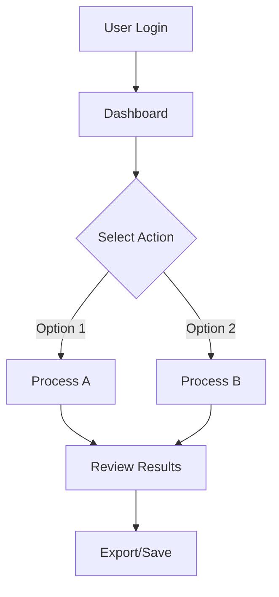

# User Guide Template

> [!NOTE]
> **Purpose of User Guide vs Installation Guide:**
> - **Installation Guide**: Focuses on setup, configuration, and getting the system running
> - **User Guide**: Focuses on how to **use** the system once it's installed and running
> - **System Architecture & MSC**: Only include simplified versions if they help users understand workflows

---

## Table of Contents

- [User Guide Template](#user-guide-template)
  - [Table of Contents](#table-of-contents)
  - [Important Components for User Guide](#important-components-for-user-guide)
  - [Template Structure](#template-structure)
    - [1. Overview and Getting Started](#1-overview-and-getting-started)
    - [2. User Authentication](#2-user-authentication)
    - [3. Core Features and Workflows](#3-core-features-and-workflows)
    - [4. User Interface Guide](#4-user-interface-guide)
    - [5. API Usage (if applicable)](#5-api-usage-if-applicable)
    - [6. Troubleshooting and FAQ](#6-troubleshooting-and-faq)
    - [7. Best Practices and Tips](#7-best-practices-and-tips)

---

## Important Components for User Guide

> [!TIP]
> **Essential Elements to Include:**

### 📋 **Must-Have Components:**
1. **Quick Start Guide** - Get users productive immediately
2. **Feature Documentation** - Comprehensive coverage of all features
3. **Step-by-Step Tutorials** - Real-world usage scenarios
4. **Screenshots/Videos** - Visual guidance for UI elements
5. **Error Handling** - What to do when things go wrong
6. **FAQ Section** - Common questions and answers

### 🎯 **User-Focused Content:**
1. **User Workflows** - How real users accomplish tasks
2. **Use Cases** - Practical examples and scenarios
3. **Best Practices** - Recommended ways to use the system
4. **Limitations** - What the system cannot do
5. **Performance Tips** - How to optimize usage

### 📊 **Architecture Information:**
- **Include**: Simplified user workflow diagrams
- **Skip**: Detailed technical architecture (already in installation guide)
- **Focus**: User journey and data flow from user perspective

---

## Template Structure

### 1. Overview and Getting Started

```markdown
# [Project Name] User Guide

## Overview
Brief description of what the system does and who should use it.

**Target Users:** [Specify user types: end-users, administrators, developers]
**Prerequisites:** [What users need to know before starting]

## Quick Start
1. Access the application at `http://your-domain.com`
2. Log in with your credentials
3. Navigate to [main feature]
4. Complete your first task in 3 steps...

### First Time Setup
- Account activation
- Profile configuration
- Initial preferences
```

### 2. User Authentication

```markdown
## User Authentication

### Logging In
1. Navigate to the login page
2. Enter your username and password
3. Click "Sign In"

### Password Reset
1. Click "Forgot Password" on login page
2. Enter your email address
3. Check your email for reset instructions

### Account Management
- Updating profile information
- Changing passwords
- Managing permissions
```

### 3. Core Features and Workflows

```markdown
## Core Features

### Feature 1: [Feature Name]
**Purpose:** What this feature accomplishes
**When to use:** Specific scenarios

**Step-by-Step Instructions:**
1. Navigate to [location]
2. Click [button/menu]
3. Fill in required fields
4. Submit/Save

**Expected Results:** What users should see

### Workflow Example: [Real Scenario]
**Scenario:** A typical user wants to [accomplish specific task]



**Detailed Steps:**
1. Start from the dashboard
2. [Continue with specific steps...]
```

### 4. User Interface Guide

```markdown
## User Interface Guide

### Dashboard Overview


**Key Elements:**
1. **Navigation Menu** - Access all features
2. **Status Panel** - System status and alerts
3. **Quick Actions** - Most common tasks
4. **Recent Activity** - Last actions performed

### Menu Navigation
- **File Menu**: Create, open, save operations
- **Tools Menu**: Utilities and configuration
- **Help Menu**: Documentation and support

### Keyboard Shortcuts
| Shortcut | Action |
|----------|--------|
| Ctrl+N   | New item |
| Ctrl+S   | Save |
| Ctrl+Z   | Undo |
```

### 5. API Usage (if applicable)

```markdown
## API Usage

> [!NOTE]
> Include only if users need to interact with APIs directly

### Authentication
```bash
curl -X POST https://api.yourapp.com/auth \
  -H "Content-Type: application/json" \
  -d '{"username": "user", "password": "pass"}'
```

### Common API Calls
**Get User Data:**
```bash
curl -X GET https://api.yourapp.com/users/me \
  -H "Authorization: Bearer YOUR_TOKEN"
```

**Example Response:**
```json
{
  "id": 123,
  "name": "John Doe",
  "email": "john@example.com"
}
```
```

### 6. Troubleshooting and FAQ

```markdown
## Troubleshooting

### Common Issues

**Issue: Cannot log in**
- **Symptoms:** Error message "Invalid credentials"
- **Causes:** Wrong password, account locked, expired session
- **Solutions:**
  1. Verify username and password
  2. Try password reset
  3. Contact administrator if account is locked

**Issue: Feature not working**
- **Symptoms:** Button grayed out, error messages
- **Causes:** Insufficient permissions, browser compatibility
- **Solutions:**
  1. Check user permissions
  2. Try different browser
  3. Clear browser cache

## Frequently Asked Questions

**Q: How do I export my data?**
A: Go to Settings > Export > Select format > Download

**Q: Can I undo my last action?**
A: Yes, use Ctrl+Z or go to Edit > Undo

**Q: Who can I contact for support?**
A: Email support@yourapp.com or use the in-app help chat
```

### 7. Best Practices and Tips

```markdown
## Best Practices

### Data Management
- Save your work frequently
- Use descriptive names for files
- Organize items in folders
- Regular backups

### Performance Tips
- Close unused tabs/windows
- Avoid uploading very large files
- Use bulk operations when possible

### Security
- Log out when finished
- Don't share login credentials
- Report suspicious activity

## Advanced Tips
- **Power Users:** Keyboard shortcuts for efficiency
- **Batch Operations:** Process multiple items at once
- **Automation:** Set up recurring tasks
- **Integration:** Connect with other tools
```

---

## Key Differences: User Guide vs Installation Guide

| Aspect | Installation Guide | User Guide |
|--------|-------------------|------------|
| **Focus** | System setup & configuration | Feature usage & workflows |
| **Audience** | System administrators, DevOps | End users, operators |
| **Architecture** | Detailed technical diagrams | Simplified user flow diagrams |
| **Content** | IP addresses, ports, dependencies | UI screenshots, step-by-step tutorials |
| **Troubleshooting** | System errors, configuration issues | User errors, feature problems |
| **Examples** | Code snippets, config files | Real usage scenarios, workflows |

---

> [!IMPORTANT]
> **When to Include Architecture in User Guide:**
> - ✅ **Include**: Simplified workflow diagrams that help users understand their journey
> - ✅ **Include**: User interaction flow (login → dashboard → feature → results)
> - ❌ **Skip**: Technical infrastructure details (IP addresses, server architecture)
> - ❌ **Skip**: Installation-specific MSCs (deployment sequences)
> 
> **Focus on the user's perspective, not the system's technical implementation.**